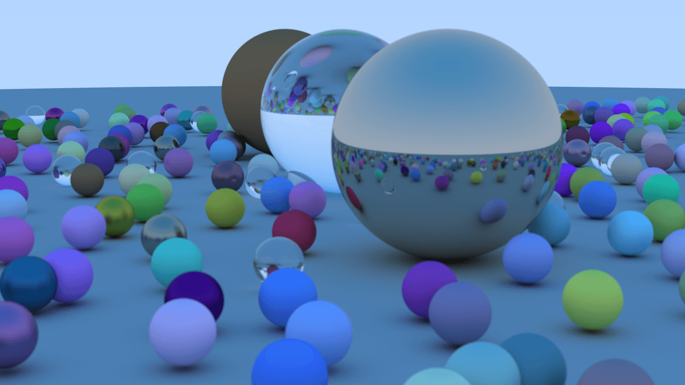

# Rust Ray Tracer

Weekend project to learn Rust by implementing a ray tracer. The project is based on the book [Ray Tracing in One Weekend](https://raytracing.github.io/books/RayTracingInOneWeekend.html). The book is a great introduction to ray tracing and the code is written in C++. Also I after finishing the book I found the [Rust version](https://misterdanb.github.io/raytracinginrust/) of the book.

## Additional features

- [x] Multithreading
- [x] Render to png
- [x] Render sequence of images
- [x] Progress bar

## Result

#### Final scene gif

<p align="center">
  
</p>

##### Parameters for gif

| Parameter         | Value      |
| ----------------- | ---------- |
| Image size        | 600x337    |
| Samples per pixel | 200        |
| Max depth         | 20         |
| Frames            | 88         |
| CPU               | 16         |
| Render time       | 4h 40m 30s |

### Final scene png



### Render scene to png

```plain
❯ cargo run --release
   Compiling rust-raytracing v0.1.0
    Finished release [optimized] target(s) in 1.69s
     Running `target/release/rust-raytracing`
⠄ [00:02:05] [########################>----------------------------------------------------] 440371/810000 (2m)
```

### How to generate GIF

```plain
❯ brew install gifski
❯ gifski -o render.gif render/image_*.png
```
